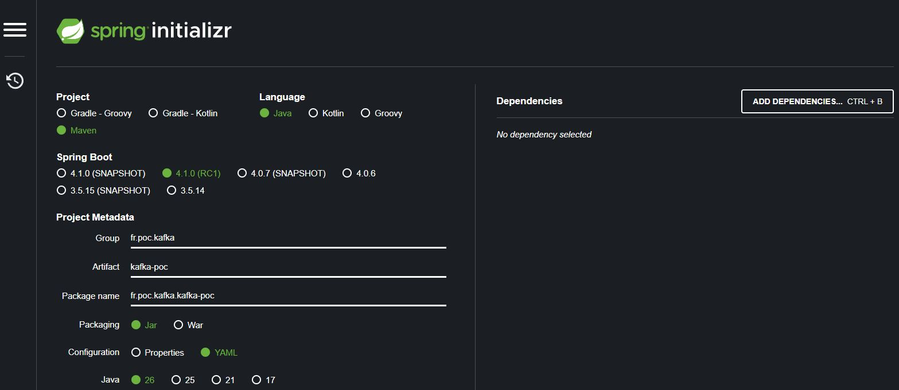

# kafka-poc
Mise en place d'une webapp spring avec kafka comme broker

## Commit xxx



## Commit #6833241

1. Architecture Hexagonale/Clean Code/DDD
   - fr.poc.kafka (src/main/java)
     - **Config** (spring boot configuration)
     - **[Bounded Context]** (µService)
       - **Application** (business features access)
       - **Domain** (centric business oriented)
         - *ent* (DDD entities)
         - *vo* (DDD value objects)
         - *ports* (outbound interfaces)
           - *primary* (input into model - interfaces)
           - *secondary* (output from model - interfaces)
         - *services* (centric business rules)          
       - **Infrastructure** (centric technical oriented)
         - *mappers* (converters from/to domain entities)
         - *primary*
           - *dtos* (presentation layer)
           - *kafka* (message broker consumers)
           - *rest* (rest services api)
         - *secondary*
           - *entities* (persistent object)
           - *kafka* (message broker producers)
           - *repository* (data access objects)
     - `MainApp.java` (project root package)

   - fr.poc.kafka (src/main/resources)
     - **db.migration** (flyway db update scripts)
     - `application.yml` (spring boot key/value configuration)
     - `logback-spring.yml` (Spring boot's logback integration configuration file)

2. Tests d'intégration avec les containers
   - Nécessite un client docker où est installer Intellij Serveur  (*docker desktop* pour windows, *wsl2* pour linux avec intellij en remote)
   - Variables d'environnement :
     ```
          DOCKER_HOST=tcp://localhost:2375
          JAVA_HOME=path/to/jdk/root/dir
     ```