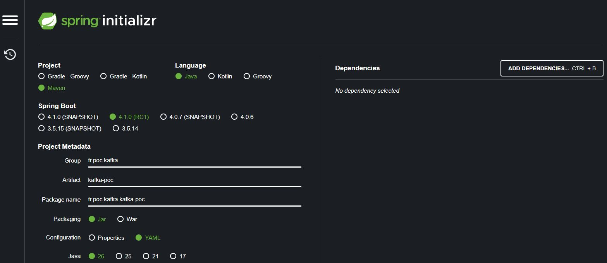

# kafka-poc
Mise en place d'une webapp spring avec kafka comme broker

## Commit #12428e6



## Commit #6833241

1. Architecture Hexagonale/Clean Code/DDD
   - fr.poc.kafka (src/main/java)
     - **Config** (spring boot configuration)
     - **[Bounded Context]** (µService)
       - **Application** (business features access)
       - **Domain** (centric business oriented)
         - *ent* (DDD entities)
         - *vo* (DDD value objects)
         - *ports* (outbound interfaces)
           - *primary* (input into model - interfaces)
           - *secondary* (output from model - interfaces)
         - *services* (centric business rules)          
       - **Infrastructure** (centric technical oriented)
         - *mappers* (converters from/to domain entities)
         - *primary*
           - *dtos* (presentation layer)
           - *kafka* (message broker consumers)
           - *rest* (rest services api)
         - *secondary*
           - *entities* (persistent object)
           - *kafka* (message broker producers)
           - *repository* (data access objects)
     - `MainApp.java` (project root package)

   - fr.poc.kafka (src/main/resources)
     - **db.migration** (flyway db update scripts)
     - `application.yml` (spring boot key/value configuration)
     - `logback-spring.yml` (Spring boot's logback integration configuration file)

2. Tests d'intégration avec les containers
   - Nécessite un client docker où est installer Intellij Serveur  (*docker desktop* pour windows, *wsl2* pour linux avec intellij en remote)
   - Variables d'environnement :
     ```
          DOCKER_HOST=tcp://localhost:2375
          JAVA_HOME=path/to/jdk/root/dir
     ``` 

Pour permettre le reuse des container, il faut mettre le fichier `.testcontainers.properties` dans `%USERPROFILE%`
La valeur à true permet de laisser l'instance de container après les tests executés.
Attention les container persistent, si on veut les supprimer entrer la commande `docker rm -f $(docker ps -aq)`
*TODO* 
> - OpenAuth avec Keycloack
> - db.migration pour le dataset de test
> - s'intruire sur la scalabilite des bdd (multitenant)
> - Le Domain Driven Design
> - Le Test Driven Development (TDD)
> - Le Clean Code
> - BDD (Behavior driven developpement)
> - PDD (Prompt driven developpement)
> - Craftmanship (logiciel bien conçu)
> - Java-Based No-Code and Low-Code Application
> - Le DevSecOps, l’infrastructure as code
> - principes SOLID
> - langchain4j (github et comparaison LLM)
> - Etudier la JVM la structure en Heap, gestion mémoire
> - WebSocket qui affiche les notifications du consumer
> - Serveless (environnement AWS cloud)